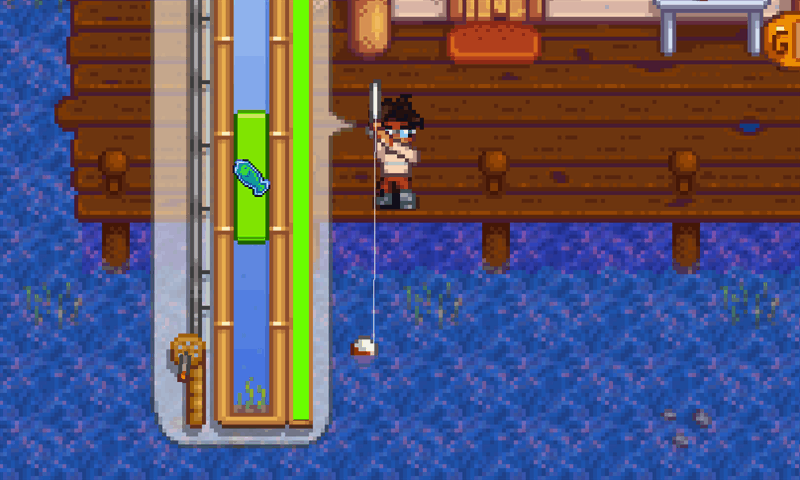

#🚧 EM ANDAMENTO 🚧

# 🎣 Stardew Valley Fishing Analysis

## 📖 Sobre o Projeto

Projeto de análise de dados utilizando Python e Pandas com foco no sistema de pesca de Stardew Valley.

O dataset foi criado manualmente por mim e contém informações sobre todos os peixes do jogo, incluindo:
- Estação
- Clima
- Horário
- Localização
- Preços
- Dificuldade
- Comportamento
- Experiência de pesca
- Equipamentos recomendados

O projeto foi desenvolvido com foco em aprendizado prático de análise de dados.

---

# 📊 Análises Realizadas

Durante o projeto foram realizadas análises como:

- Peixes com melhor custo-benefício
- Relação entre dificuldade e lucro
- Comparação entre valor de venda e dificuldade de captura

---

# ⚠️ Importante

Algumas informações foram simplificadas para manter consistência e facilitar a análise dos dados.

---

# 🛠️ Tecnologias Utilizadas

- Python
- Pandas
- Jupyter Notebook
- CSV
- Visual Studio Code

---

# 🧹 Tratamento e Limpeza dos Dados

O projeto também possui foco em:

- Tratamento de valores nulos
- Padronização de nomes e textos
- Separação de horários de início e fim
- Criação de novas colunas para análise
- Ajuste de dados inconsistentes
- Manipulação de DataFrames com Pandas

---

# 📌 Mais Informações

## 🎮 Sobre Stardew Valley

Stardew Valley é um jogo indie de simulação e fazenda desenvolvido por Eric Barone (*ConcernedApe*).

O jogo possui diversos sistemas, como:
- Agricultura
- Mineração
- Combate
- Relacionamentos
- Pesca

A pesca é uma das mecânicas mais populares do jogo, contando com dezenas de peixes diferentes, cada um possuindo:
- Locais específicos
- Horários específicos
- Condições climáticas
- Níveis de dificuldade
- Comportamentos únicos durante o mini-game

---

# 🗂️ Estrutura do Dataset

| Coluna | Descrição |
|---|---|
| Nome | Nome do peixe |
| Estacao | Estação em que o peixe aparece |
| Clima | Clima necessário para captura |
| Horario | Horário disponível para pesca |
| Localizacao | Área onde o peixe pode ser encontrado |
| Preco_Base | Valor base do peixe |
| Preco_Ouro | Valor na qualidade ouro |
| Preco_Iridio | Valor na qualidade irídio |
| Dificuldade | Nível de dificuldade do mini-game |
| Comportamento | Tipo de movimentação do peixe |
| Xp_Pesca | Experiência recebida ao capturar |
| Vara_Recomendada | Vara recomendada para captura |
| Isca_Recomendada | Isca recomendada para captura |

---

# 🧠 Comportamento dos Peixes

Durante o mini-game de pesca, os peixes possuem padrões diferentes de movimentação.

| Tipo | Descrição |
|---|---|
| Misto | Utilizam o padrão de movimento básico |
| Suave | Possuem movimento mais estável |
| Pesado | Possuem aceleração mais rápida para baixo |
| Flutuador | Possuem aceleração mais rápida para cima |
| Dardo | Movem-se com amplitude muito maior em ambas as direções |
